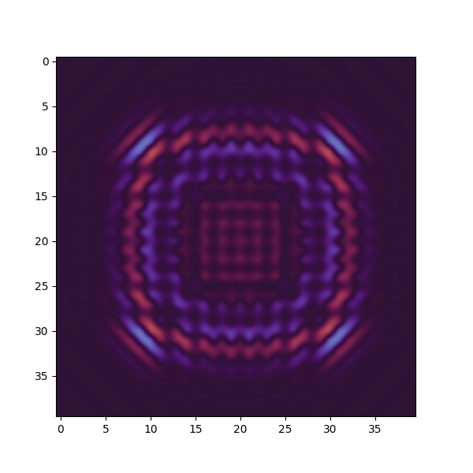
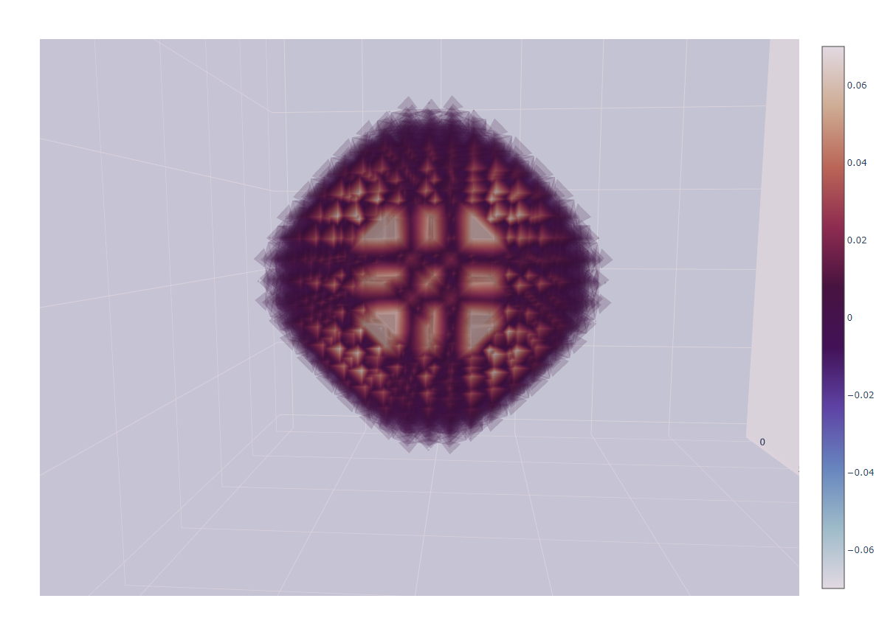
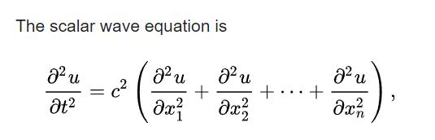

# Wave Simulation Experiment in Python

## Introduction

This is a small experiment with wave simulations in up to 3 dimensions. The 3D version can be visualized with a volume rendering technique, or by making a 2D slice.

## Eye Candy

## Equation

The following is the general equation that we need to use.

You can think of u(x, y, z, t) as a function that takes in the position and time, and returns the value at that point and time. The left side of the equation can be thought of as the rate of change *of the rate of change* of the value at that point with respect to time (I just call it acceleration, although it's probably not the best term to use here). The right side is speed^2 times the sum of the second gradients of the value in each dimension, while time stays constant.

## Resources

 - [Wave equation - Wikipedia](https://en.wikipedia.org/wiki/Wave_equation)
 - [Partial derivative - Wikipedia](https://en.wikipedia.org/wiki/Partial_derivative)

## Performance

You shouldn't expect too much performance out of a single-threaded Python script, but this is enough for getting started. I'm currently working on a C++ version with multithreading and a whole lot of optimizations. We could also utilize discrete GPUs to speed up the simulation even more, since it's fairly parallelizable (kinda sorta). I may or may not publish the C++ version in the future.

## Disclaimer

I am not an expert nor a scientist, just a learner. If you find any mistakes, feel free to create an issue about it.
